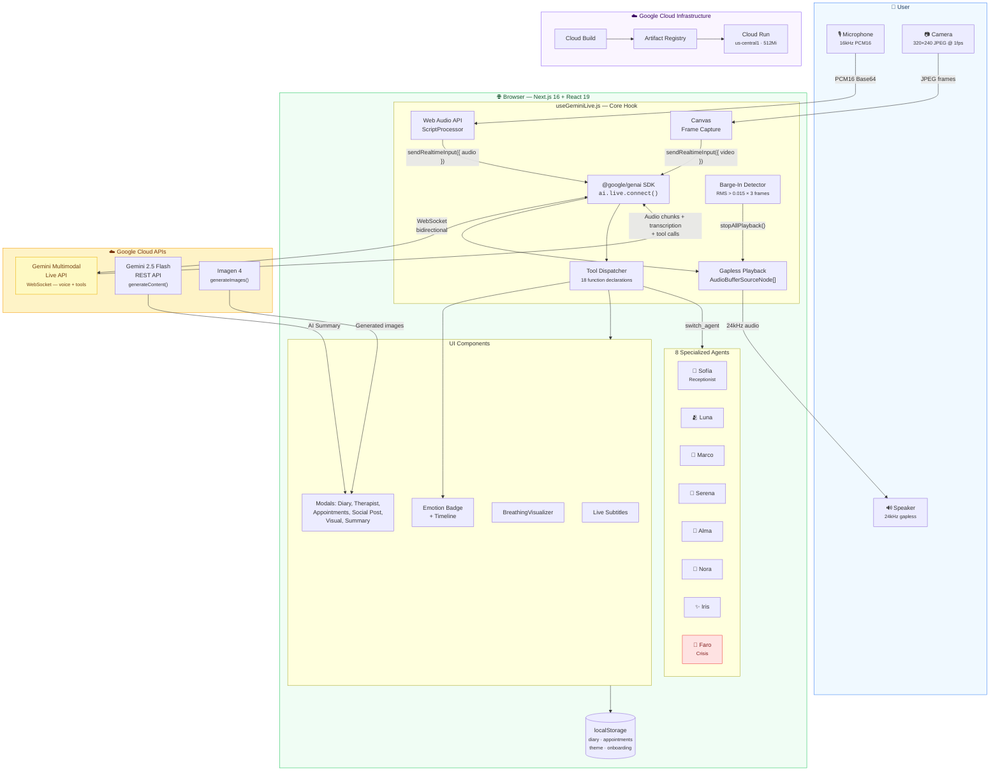
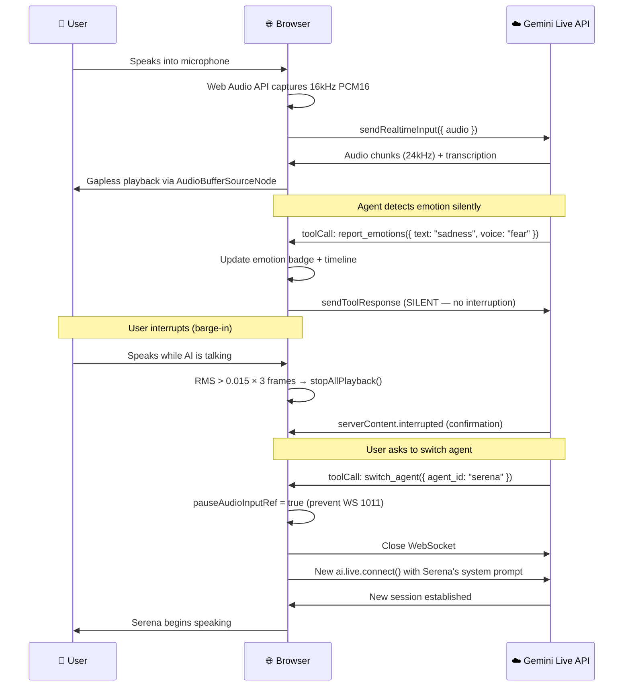

# Sanemos AI Live — Project Story

## Inspiration

After losing my wife, Omaira — *Omy* — after 19 years together, I discovered a painful truth: **grief has no schedule**. The deepest crises hit at 3:00 AM, when the world sleeps, therapists don't answer, and the silence at home becomes unbearable.

I had already built [sanemos.ai](https://sanemos.ai), a social network for people navigating grief — a place for shared stories, resources, and community. But content alone wasn't enough. When someone is sobbing at midnight, they don't need an article. They need a voice. Someone — or something — that listens without judgment, that doesn't hang up, that never turns off the light.

**Sanemos AI Live** was born from that gap: extending our grief support platform into a **24/7 multimodal voice companion** powered by Google's Gemini Multimodal Live API. Not a chatbot. A team of 8 specialized AI agents that talk with you, listen to your tone of voice, read your facial expressions, and respond with the warmth and specificity that grief demands.

---

## What it does

Sanemos AI Live provides **real-time voice conversations** with 8 specialized AI companions, each designed for a different dimension of grief:

| Agent | Role | Specialty |
|-------|------|-----------|
| **Sofía** 👋 | Receptionist | Welcomes users, routes to the right agent, offers a guided onboarding tour |
| **Luna** 🫂 | Empathic Listener | Active listening, emotional validation — like a trusted friend beside you |
| **Marco** 🧭 | Grief Guide | Psychoeducation about grief stages, normalizing the experience |
| **Serena** 🧘 | Mindfulness | Breathing exercises (box, 4-7-8), grounding techniques, guided imagery |
| **Alma** 📖 | Storyteller | Therapeutic narrative, metaphors, meaning-making through stories |
| **Nora** 🐾 | Pet Loss | Honoring the human-animal bond — because pet grief is real grief |
| **Iris** ✨ | Separation | Navigating divorce, identity transformation, coexisting emotions |
| **Faro** 🚨 | Crisis | Immediate intervention with regional crisis hotlines, auto-escalation |

### Key features

- **Bidirectional voice** — Talk naturally, interrupt the AI mid-sentence, and it adapts instantly (client-side barge-in detection in ~150ms)
- **Multimodal emotion detection** — Analyzes what you say (text), how you say it (voice tone), and your facial expressions (optional camera) to track emotional state in real time
- **Personal diary** — Save sessions privately in your browser, review past entries with AI-generated summaries and emotion timelines
- **Therapist integration** — Send session summaries to a professional (Dr. María Torres), book appointments by voice ("Wednesday at 5pm")
- **Breathing exercises** — Serena guides you through synchronized breathing visualizations with animated circles
- **Visual generation** — Marco creates educational grief illustrations; Serena generates calming mindfulness imagery
- **Social media posts** — Generate commemorative posts for Facebook, Instagram, or X with AI-created images (Imagen 4)
- **Crisis auto-escalation** — If any agent detects suicidal ideation, Faro activates immediately with regional hotline numbers (988 US, 717 003 717 Spain, *4141 Chile, 135 Argentina, SAPTEL Mexico)
- **Post-session summary** — AI-generated recap with 4 sections: Emotional Summary, Key Themes, Resources, and a Closing Message
- **Bilingual** — Full Spanish and English support (150+ translation keys)
- **Dark/Light/System theme** — Persistent, with FOUC prevention
- **Privacy-first** — All data stays in your browser (localStorage). No backend database, no data leaves your machine beyond the AI conversation itself

---

## How we built it

### Architecture: No intermediary server

The core design decision was **zero latency overhead**. The browser connects directly to Gemini's Live API via WebSocket — no proxy, no relay, no backend. This means voice responses arrive as fast as the model can generate them.

**Key design choice:** There is **no backend server** between the user and Gemini. The Next.js app is a static SPA served by Cloud Run. All AI communication happens client-side via the `@google/genai` SDK, achieving the lowest possible latency for voice conversations.

### Voice session data flow

### Stack

| Layer | Technology |
|-------|-----------|
| Framework | Next.js 16 (Turbopack) + React 19 |
| Styling | Tailwind CSS v4 with semantic color tokens |
| Voice sessions | `@google/genai` SDK → `ai.live.connect()` |
| Summaries | `ai.models.generateContent()` (Gemini 2.5 Flash) |
| Image generation | `ai.models.generateImages()` (Imagen 4) |
| Audio | Pure Web Audio API — 16kHz capture, 24kHz gapless playback, zero external libraries |
| Video | `getUserMedia` → canvas downscale (320×240 JPEG @ 1fps) |
| Persistence | localStorage (diary, appointments, theme, onboarding) |
| Deployment | Google Cloud Run + Cloud Build + Artifact Registry |

### Tool system

Each agent has a dynamically-built set of **function declarations** (up to 18 tools), scoped by role:

- **All agents**: `end_session`, `switch_agent`, UI tools (clipboard, URLs, modals)
- **All except Sofía**: Emotion detection tools (text, voice, facial)
- **All except Faro**: Diary, therapist, appointments, social posts
- **Serena only**: `start_breathing_exercise`, `stop_breathing_exercise`
- **Marco & Serena only**: `generate_visual` (educational diagrams, calming imagery)
- **Sofía only**: `mark_onboarding_done`
- **All except Faro**: `escalate_to_crisis_faro` (Faro can't self-escalate)

Tools are categorized as **destructive** (end_session, switch_agent, escalate — no toolResponse sent, audio paused) or **non-destructive** (silent toolResponse with `scheduling: "SILENT"` so the model keeps talking).

---

## Challenges we ran into

### WebSocket 1011: The invisible killer

The most persistent and dangerous bug. While the model processes a tool call, the browser's audio worklet keeps streaming microphone data via `sendRealtimeInput`. The server's VAD interprets this as a barge-in, cancels the pending tool call, and crashes with error code 1011.

**Solution**: We introduced `pauseAudioInputRef` — a flag that freezes audio transmission during destructive tool calls. For `switch_agent` specifically, we added `pendingSwitchAgentIdRef` to store the target agent ID, so if a 1011 still occurs mid-transition, the `onclose` handler completes the switch.

This bug is partially documented in [googleapis/js-genai#1210](https://github.com/googleapis/js-genai/issues/1210), which reports a ~50% tool call failure rate with native audio models.

### Gapless audio playback

Gemini sends audio in small PCM chunks. Naively playing each chunk as it arrives creates audible gaps. We implemented **scheduled playback** using `AudioBufferSourceNode.start(scheduledTime)` with a dedicated 24kHz AudioContext, tracking each source node in an array for instant stop on barge-in.

### Client-side barge-in

Waiting for the server's `interrupted` signal adds ~200-400ms of latency. We implemented **client-side detection**: monitoring the microphone's RMS level during AI playback. When RMS exceeds 0.015 for 3 consecutive frames (~150ms), we call `stopAllPlayback()` immediately — faster than the network roundtrip. The server's `interrupted` signal still arrives and is handled as confirmation.

### Stale closures in WebSocket handlers

React's functional components create closures over state values. But `ws.onmessage` captures state at connection time, not at message time. Every mutable value accessed inside WebSocket handlers needed a `useRef` mirror — `messagesRef`, `currentMsgRef`, `pauseAudioInputRef`, and others.

### React strict mode + WebSocket

Strict mode's double-mount in development caused two simultaneous WebSocket connections fighting for the microphone. Fixed with a `wsRef.current !== ws` guard in all event handlers.

### Setup message format

The Gemini Live API rejects `input_audio_transcription` (snake_case) but accepts `inputAudioTranscription` (camelCase). `speechConfig` goes inside `generationConfig`, but transcription config goes at the setup root level. None of this was clearly documented — we found it through trial and error.

---

## Accomplishments that we're proud of

- **A team, not a chatbot** — 8 agents with distinct voices (Aoede, Orus, Kore, Leda, Fenrir), personalities, system prompts, and tool sets. Users talk to Luna when they need to be heard, switch to Serena when they need to breathe, and Faro is always watching in the background.

- **Crisis detection that actually works** — Any agent can escalate to Faro if they detect distress. Faro activates within seconds, provides regional crisis hotlines, and stays present. We don't pretend to replace emergency services, but we bridge the gap at 3 AM.

- **Sub-200ms interruption** — Client-side barge-in detection means users can interrupt the AI mid-sentence and it stops instantly. No "please wait for me to finish" experience.

- **18 tools, zero crashes** — Function calling with native audio models is notoriously unreliable (~50% failure rate per Google's own issue tracker). Our `pauseAudioInputRef` + `pendingSwitchAgentIdRef` + `SILENT` scheduling pattern brought tool reliability to production-grade levels.

- **Privacy by architecture** — No backend database. Every diary entry, appointment, and preference lives in the user's browser. The only data that leaves the machine is the voice conversation itself.

---

## What we learned

1. **The Gemini Live API is powerful but unforgiving.** Setup message format, tool call timing, audio streaming cadence — small mistakes crash the WebSocket with cryptic error codes. We documented everything in [GEMINI_LIVE_BEST_PRACTICES.md](GEMINI_LIVE_BEST_PRACTICES.md).

2. **Audio and tool calls don't mix.** The server's VAD doesn't know the difference between the user speaking and background microphone noise during a tool call. You *must* pause audio input during destructive operations.

3. **`NON_BLOCKING` + `SILENT` scheduling is essential** for observation tools. Without it, every emotion report interrupts the agent's speech.

4. **Client-side interruption beats server-side.** RMS-based detection on the client is 3-5x faster than waiting for the server's `interrupted` signal.

5. **PII scrubbing on AI-generated text causes more harm than good.** Our NER model flagged generic words like "amor" (love) and "esperanza" (hope) as person names. We learned to only scrub user input, never AI output.

6. **Grief support requires nuance that general-purpose AI doesn't have.** Each agent needed carefully crafted system prompts to avoid platitudes ("everything happens for a reason"), echo chambers (reinforcing negative spirals), and clinical detachment. We added explicit instructions for echo chamber prevention and boundary enforcement.

---

## What's next

- **Real therapist marketplace** — Connect users with licensed grief counselors, not just a hardcoded profile
- **Session resumption** — Use Gemini's `sessionResumption` tokens for conversations longer than 15 minutes without losing context
- **Group support sessions** — Multiple users in a room with a facilitator agent
- **Mobile native app** — React Native version for on-the-go access
- **More languages** — Portuguese, French, and other languages where grief support resources are scarce
- **Longitudinal tracking** — Emotion trends over weeks and months, with insights shared (with consent) with the user's therapist

---

## Built with

- Google Gemini Multimodal Live API
- Google Gemini 2.5 Flash (Native Audio)
- Google Imagen 4
- Google Cloud Run
- Google Cloud Build
- Google Artifact Registry
- @google/genai SDK
- Next.js 16
- React 19
- Tailwind CSS v4
- Web Audio API

---

*Sanemos means "let us heal" in Spanish. Because healing shouldn't wait until office hours.*

\#GeminiLiveAgentChallenge
