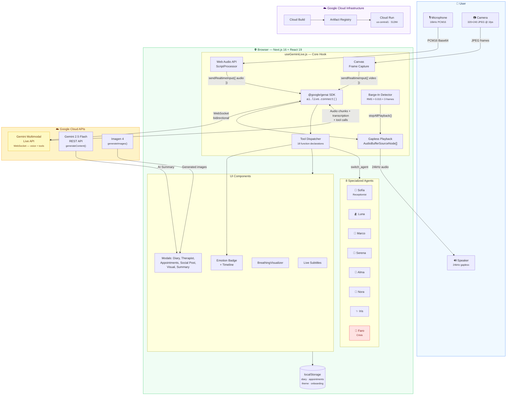
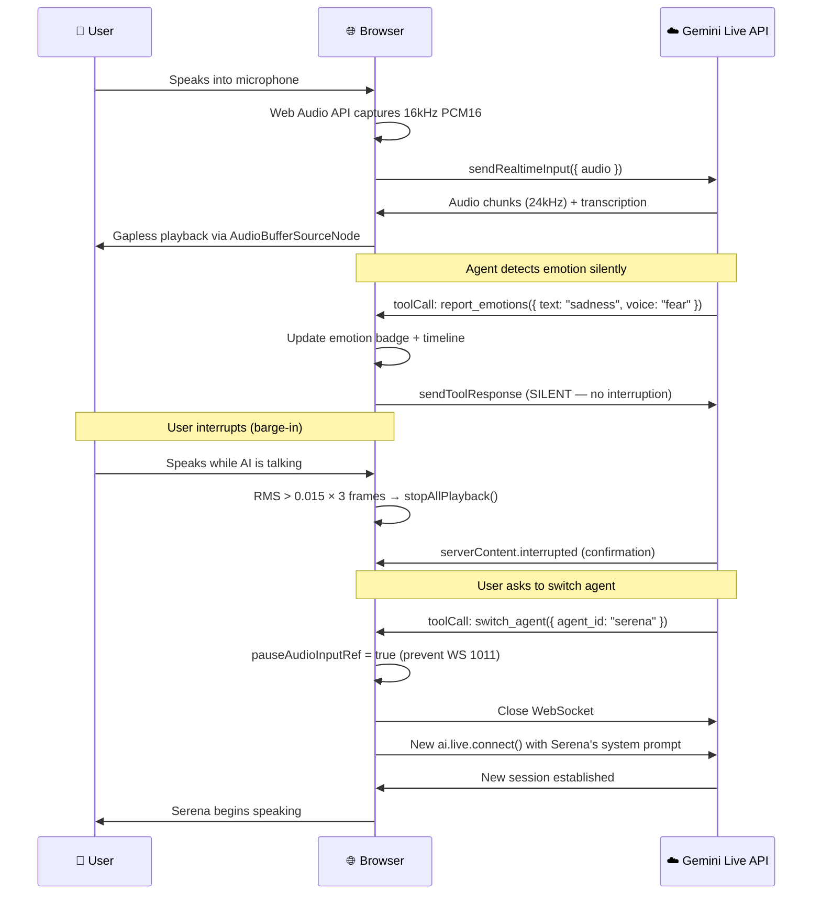

# Sanemos AI Live — Complete Project Documentation

> Combined documentation for NotebookLM. Generated 2026-03-14.

---


<!-- ═══════════════════════════════════════════════════════════ -->
<!-- FILE: PROJECT_STORY.md -->
<!-- ═══════════════════════════════════════════════════════════ -->

# Sanemos AI Live — Project Story

## Inspiration

After losing my wife, Omaira — *Omy* — after 19 years together, I discovered a painful truth: **grief has no schedule**. The deepest crises hit at 3:00 AM, when the world sleeps, therapists don't answer, and the silence at home becomes unbearable.

I had already built [sanemos.ai](https://sanemos.ai), a social network for people navigating grief — a place for shared stories, resources, and community. But content alone wasn't enough. When someone is sobbing at midnight, they don't need an article. They need a voice. Someone — or something — that listens without judgment, that doesn't hang up, that never turns off the light.

**Sanemos AI Live** was born from that gap: extending our grief support platform into a **24/7 multimodal voice companion** powered by Google's Gemini Multimodal Live API. Not a chatbot. A team of 8 specialized AI agents that talk with you, listen to your tone of voice, read your facial expressions, and respond with the warmth and specificity that grief demands.

---

## What it does

Sanemos AI Live provides **real-time voice conversations** with 8 specialized AI companions, each designed for a different dimension of grief:

| Agent | Role | Specialty |
|-------|------|-----------|
| **Sofía** 👋 | Receptionist | Welcomes users, routes to the right agent, offers a guided onboarding tour |
| **Luna** 🫂 | Empathic Listener | Active listening, emotional validation — like a trusted friend beside you |
| **Marco** 🧭 | Grief Guide | Psychoeducation about grief stages, normalizing the experience |
| **Serena** 🧘 | Mindfulness | Breathing exercises (box, 4-7-8), grounding techniques, guided imagery |
| **Alma** 📖 | Storyteller | Therapeutic narrative, metaphors, meaning-making through stories |
| **Nora** 🐾 | Pet Loss | Honoring the human-animal bond — because pet grief is real grief |
| **Iris** ✨ | Separation | Navigating divorce, identity transformation, coexisting emotions |
| **Faro** 🚨 | Crisis | Immediate intervention with regional crisis hotlines, auto-escalation |

### Key features

- **Bidirectional voice** — Talk naturally, interrupt the AI mid-sentence, and it adapts instantly (client-side barge-in detection in ~150ms)
- **Multimodal emotion detection** — Analyzes what you say (text), how you say it (voice tone), and your facial expressions (optional camera) to track emotional state in real time
- **Personal diary** — Save sessions privately in your browser, review past entries with AI-generated summaries and emotion timelines
- **Therapist integration** — Send session summaries to a professional (Dr. María Torres), book appointments by voice ("Wednesday at 5pm")
- **Breathing exercises** — Serena guides you through synchronized breathing visualizations with animated circles
- **Visual generation** — Marco creates educational grief illustrations; Serena generates calming mindfulness imagery
- **Social media posts** — Generate commemorative posts for Facebook, Instagram, or X with AI-created images (Imagen 4)
- **Crisis auto-escalation** — If any agent detects suicidal ideation, Faro activates immediately with regional hotline numbers (988 US, 717 003 717 Spain, *4141 Chile, 135 Argentina, SAPTEL Mexico)
- **Post-session summary** — AI-generated recap with 4 sections: Emotional Summary, Key Themes, Resources, and a Closing Message
- **Bilingual** — Full Spanish and English support (150+ translation keys)
- **Dark/Light/System theme** — Persistent, with FOUC prevention
- **Privacy-first** — All data stays in your browser (localStorage). No backend database, no data leaves your machine beyond the AI conversation itself

---

## How we built it

### Architecture: No intermediary server

The core design decision was **zero latency overhead**. The browser connects directly to Gemini's Live API via WebSocket — no proxy, no relay, no backend. This means voice responses arrive as fast as the model can generate them.



**Key design choice:** There is **no backend server** between the user and Gemini. The Next.js app is a static SPA served by Cloud Run. All AI communication happens client-side via the `@google/genai` SDK, achieving the lowest possible latency for voice conversations.

### Voice session data flow



### Stack

| Layer | Technology |
|-------|-----------|
| Framework | Next.js 16 (Turbopack) + React 19 |
| Styling | Tailwind CSS v4 with semantic color tokens |
| Voice sessions | `@google/genai` SDK → `ai.live.connect()` |
| Summaries | `ai.models.generateContent()` (Gemini 2.5 Flash) |
| Image generation | `ai.models.generateImages()` (Imagen 4) |
| Audio | Pure Web Audio API — 16kHz capture, 24kHz gapless playback, zero external libraries |
| Video | `getUserMedia` → canvas downscale (320×240 JPEG @ 1fps) |
| Persistence | localStorage (diary, appointments, theme, onboarding) |
| Deployment | Google Cloud Run + Cloud Build + Artifact Registry |

### Tool system

Each agent has a dynamically-built set of **function declarations** (up to 18 tools), scoped by role:

- **All agents**: `end_session`, `switch_agent`, UI tools (clipboard, URLs, modals)
- **All except Sofía**: Emotion detection tools (text, voice, facial)
- **All except Faro**: Diary, therapist, appointments, social posts
- **Serena only**: `start_breathing_exercise`, `stop_breathing_exercise`
- **Marco & Serena only**: `generate_visual` (educational diagrams, calming imagery)
- **Sofía only**: `mark_onboarding_done`
- **All except Faro**: `escalate_to_crisis_faro` (Faro can't self-escalate)

Tools are categorized as **destructive** (end_session, switch_agent, escalate — no toolResponse sent, audio paused) or **non-destructive** (silent toolResponse with `scheduling: "SILENT"` so the model keeps talking).

---

## Challenges we ran into

### WebSocket 1011: The invisible killer

The most persistent and dangerous bug. While the model processes a tool call, the browser's audio worklet keeps streaming microphone data via `sendRealtimeInput`. The server's VAD interprets this as a barge-in, cancels the pending tool call, and crashes with error code 1011.

**Solution**: We introduced `pauseAudioInputRef` — a flag that freezes audio transmission during destructive tool calls. For `switch_agent` specifically, we added `pendingSwitchAgentIdRef` to store the target agent ID, so if a 1011 still occurs mid-transition, the `onclose` handler completes the switch.

This bug is partially documented in [googleapis/js-genai#1210](https://github.com/googleapis/js-genai/issues/1210), which reports a ~50% tool call failure rate with native audio models.

### Gapless audio playback

Gemini sends audio in small PCM chunks. Naively playing each chunk as it arrives creates audible gaps. We implemented **scheduled playback** using `AudioBufferSourceNode.start(scheduledTime)` with a dedicated 24kHz AudioContext, tracking each source node in an array for instant stop on barge-in.

### Client-side barge-in

Waiting for the server's `interrupted` signal adds ~200-400ms of latency. We implemented **client-side detection**: monitoring the microphone's RMS level during AI playback. When RMS exceeds 0.015 for 3 consecutive frames (~150ms), we call `stopAllPlayback()` immediately — faster than the network roundtrip. The server's `interrupted` signal still arrives and is handled as confirmation.

### Stale closures in WebSocket handlers

React's functional components create closures over state values. But `ws.onmessage` captures state at connection time, not at message time. Every mutable value accessed inside WebSocket handlers needed a `useRef` mirror — `messagesRef`, `currentMsgRef`, `pauseAudioInputRef`, and others.

### React strict mode + WebSocket

Strict mode's double-mount in development caused two simultaneous WebSocket connections fighting for the microphone. Fixed with a `wsRef.current !== ws` guard in all event handlers.

### Setup message format

The Gemini Live API rejects `input_audio_transcription` (snake_case) but accepts `inputAudioTranscription` (camelCase). `speechConfig` goes inside `generationConfig`, but transcription config goes at the setup root level. None of this was clearly documented — we found it through trial and error.

---

## Accomplishments that we're proud of

- **A team, not a chatbot** — 8 agents with distinct voices (Aoede, Orus, Kore, Leda, Fenrir), personalities, system prompts, and tool sets. Users talk to Luna when they need to be heard, switch to Serena when they need to breathe, and Faro is always watching in the background.

- **Crisis detection that actually works** — Any agent can escalate to Faro if they detect distress. Faro activates within seconds, provides regional crisis hotlines, and stays present. We don't pretend to replace emergency services, but we bridge the gap at 3 AM.

- **Sub-200ms interruption** — Client-side barge-in detection means users can interrupt the AI mid-sentence and it stops instantly. No "please wait for me to finish" experience.

- **18 tools, zero crashes** — Function calling with native audio models is notoriously unreliable (~50% failure rate per Google's own issue tracker). Our `pauseAudioInputRef` + `pendingSwitchAgentIdRef` + `SILENT` scheduling pattern brought tool reliability to production-grade levels.

- **Privacy by architecture** — No backend database. Every diary entry, appointment, and preference lives in the user's browser. The only data that leaves the machine is the voice conversation itself.

---

## What we learned

1. **The Gemini Live API is powerful but unforgiving.** Setup message format, tool call timing, audio streaming cadence — small mistakes crash the WebSocket with cryptic error codes. We documented everything in [GEMINI_LIVE_BEST_PRACTICES.md](GEMINI_LIVE_BEST_PRACTICES.md).

2. **Audio and tool calls don't mix.** The server's VAD doesn't know the difference between the user speaking and background microphone noise during a tool call. You *must* pause audio input during destructive operations.

3. **`NON_BLOCKING` + `SILENT` scheduling is essential** for observation tools. Without it, every emotion report interrupts the agent's speech.

4. **Client-side interruption beats server-side.** RMS-based detection on the client is 3-5x faster than waiting for the server's `interrupted` signal.

5. **PII scrubbing on AI-generated text causes more harm than good.** Our NER model flagged generic words like "amor" (love) and "esperanza" (hope) as person names. We learned to only scrub user input, never AI output.

6. **Grief support requires nuance that general-purpose AI doesn't have.** Each agent needed carefully crafted system prompts to avoid platitudes ("everything happens for a reason"), echo chambers (reinforcing negative spirals), and clinical detachment. We added explicit instructions for echo chamber prevention and boundary enforcement.

---

## What's next

- **Real therapist marketplace** — Connect users with licensed grief counselors, not just a hardcoded profile
- **Session resumption** — Use Gemini's `sessionResumption` tokens for conversations longer than 15 minutes without losing context
- **Group support sessions** — Multiple users in a room with a facilitator agent
- **Mobile native app** — React Native version for on-the-go access
- **More languages** — Portuguese, French, and other languages where grief support resources are scarce
- **Longitudinal tracking** — Emotion trends over weeks and months, with insights shared (with consent) with the user's therapist

---

## Built with

- Google Gemini Multimodal Live API
- Google Gemini 2.5 Flash (Native Audio)
- Google Imagen 4
- Google Cloud Run
- Google Cloud Build
- Google Artifact Registry
- @google/genai SDK
- Next.js 16
- React 19
- Tailwind CSS v4
- Web Audio API

---

*Sanemos means "let us heal" in Spanish. Because healing shouldn't wait until office hours.*

\#GeminiLiveAgentChallenge

---


<!-- ═══════════════════════════════════════════════════════════ -->
<!-- FILE: README.md -->
<!-- ═══════════════════════════════════════════════════════════ -->

# Sanemos AI Live — Grief Support with Real-Time Voice AI

Sanemos AI Live is a grief support platform that provides real-time voice conversations with 8 specialized AI companions using the **Gemini Multimodal Live API** and the **Google GenAI SDK** (`@google/genai`).

Users can talk naturally, be interrupted, switch between agents, and access tools like a personal diary, therapist referral, appointment booking, breathing exercises, social media post generation, and more — all through voice.

**Category:** Live Agents | **Hackathon:** Gemini Live Agent Challenge

## Features

- **8 Specialized Agents** — Sofia (receptionist/router), Luna, Marco, Serena, Alma, Nora, Iris (grief companions), Faro (crisis)
- **Real-Time Voice** — Bidirectional audio via Gemini Live API with gapless playback (16kHz in / 24kHz out)
- **Vision Input** — Optional camera for facial emotion detection (JPEG 320x240 @ 1fps)
- **Emotion Detection** — Text, voice, and facial emotion tracking with timeline visualization
- **Personal Diary** — Save sessions to a local diary, view entries with summaries
- **Therapist Referral** — Send session summaries to a therapist, book appointments
- **Breathing Exercises** — Guided visualization (box, 4-7-8, simple) with Serena
- **Social Media Posts** — Generate commemorative posts for Facebook, Instagram, X
- **Post-Session Summary** — AI-generated recap with emotional analysis, themes, resources
- **Onboarding Tour** — Sofia guides new users through all 10 features by voice
- **i18n** — Full Spanish/English support (150+ translation keys)
- **Dark/Light/System Theme** — Persistent theme with FOUC prevention
- **Barge-In (Interruption)** — Graceful interruption handling: client-side RMS detection + server VAD, stops AI playback instantly
- **Auto-Reconnect** — Transparent reconnection on session timeout (1008/1011)
- **Crisis Detection** — Automatic escalation to Faro crisis agent
- **WS 1011 Prevention** — Audio input paused during destructive tool calls to prevent server VAD conflicts

## Tech Stack

| Technology | Usage |
|---|---|
| **Next.js 16** | Framework (React 19, Turbopack) |
| **@google/genai SDK** | Gemini Live API (voice sessions) + REST API (summaries) |
| **Gemini 2.5 Flash** | Native audio model for real-time conversation |
| **Tailwind CSS v4** | Styling |
| **Google Cloud Run** | Production hosting |
| **Google Cloud Build** | CI/CD pipeline |
| **Google Artifact Registry** | Container image storage |

## Architecture

Interactive architecture diagram available at `/architecture` in the app.

```
┌─────────────┐    WebSocket (Live API)    ┌──────────────────┐
│   Browser    │ ◄═══════════════════════► │  Gemini Live API  │
│  (Next.js)   │    @google/genai SDK      │  (Google Cloud)   │
│              │                           └──────────────────┘
│  8 Agents    │    REST API (Summary)     ┌──────────────────┐
│  Audio I/O   │ ─────────────────────────►│  Gemini 2.5 Flash │
│  Video I/O   │    @google/genai SDK      │  (Google Cloud)   │
│  Tools/UI    │                           └──────────────────┘
└──────┬───────┘
       │  Deployed on
       ▼
┌──────────────┐    ┌─────────────────┐    ┌───────────────────┐
│  Cloud Run   │◄───│  Cloud Build    │◄───│ Artifact Registry │
│ (us-central1)│    │  (CI/CD)        │    │ (Container images)│
└──────────────┘    └─────────────────┘    └───────────────────┘
```

## Getting Started

### Prerequisites

- **Node.js 20+**
- **Google Cloud API Key** with Generative Language API enabled
  - **Important:** Do NOT set HTTP Referrer restrictions (WebSocket doesn't send Referer)
  - Recommended: Restrict to Generative Language API only

### 1. Clone and Install

```bash
git clone https://github.com/YOUR_USERNAME/sanemos-live-demo.git
cd sanemos-live-demo
npm install
```

### 2. Configure Environment

Create a `.env.local` file in the project root:

```bash
NEXT_PUBLIC_GEMINI_API_KEY=your-gemini-api-key-here
NEXT_PUBLIC_ACCESS_CODE=optional-access-code-for-demo
```

### 3. Run Development Server

```bash
npm run dev
```

Open [http://localhost:3000](http://localhost:3000) in your browser (Chrome recommended for microphone/camera access).

### 4. Build for Production

```bash
npm run build
npm start
```

## Deploy to Google Cloud Run

The project includes automated deployment via Cloud Build:

```bash
gcloud builds submit --config cloudbuild.yaml \
  --substitutions="_NEXT_PUBLIC_GEMINI_API_KEY=your-key,_NEXT_PUBLIC_ACCESS_CODE=your-code"
```

This will:
1. Build a Docker image with `Dockerfile` (multi-stage Node.js 20 Alpine)
2. Push to Artifact Registry (`us-central1-docker.pkg.dev`)
3. Deploy to Cloud Run (512Mi, port 3000, unauthenticated)

Infrastructure-as-code files: [`cloudbuild.yaml`](cloudbuild.yaml) + [`Dockerfile`](Dockerfile)

## Google Cloud Services Used

| Service | Purpose |
|---|---|
| **Gemini Multimodal Live API** | Real-time bidirectional voice/video AI conversations |
| **Gemini REST API** | Post-session summary generation |
| **Imagen 4 API** | AI-generated images for social media posts and visual content |
| **Cloud Run** | Serverless container hosting |
| **Cloud Build** | Automated CI/CD pipeline |
| **Artifact Registry** | Docker image storage |

## Project Structure

```
src/
├── hooks/useGeminiLive.js      # Core: SDK Live session, audio, tools
├── components/
│   ├── GeminiLiveSession.js    # Session UI, modals, transcription
│   ├── SessionSummary.js       # AI-generated post-session recap
│   ├── SocialPostModal.js      # Social media post display
│   ├── VisualModal.js          # Visual generation display (Marco/Serena)
│   ├── BreathingVisualizer.js  # Breathing exercise visualization
│   ├── DiaryModal.js           # Personal diary viewer
│   ├── TherapistModal.js       # Therapist referral
│   └── AppointmentModal.js     # Appointment booking
├── lib/
│   ├── agents.js               # 8 agent definitions + system prompts
│   ├── diary.js                # Diary CRUD (localStorage)
│   └── therapist.js            # Therapist data + appointment slots
├── i18n/                       # Spanish/English translations
└── theme/                      # Dark/Light/System theme
```

## License

Built for the [Gemini Live Agent Challenge](https://devpost.com) hackathon.

#GeminiLiveAgentChallenge

---


<!-- ═══════════════════════════════════════════════════════════ -->
<!-- FILE: DEMO_OVERVIEW.md -->
<!-- ═══════════════════════════════════════════════════════════ -->

# Sanemos AI Live — Demo Overview

## Qué es Sanemos AI Live

Sanemos AI Live es una plataforma de acompañamiento emocional en duelo que utiliza la **Google GenAI SDK** (`@google/genai`) con la **Gemini Multimodal Live API** para crear conversaciones de voz en tiempo real con agentes de IA especializados. Todo el procesamiento ocurre client-side a través del SDK, logrando latencia ultrabaja sin servidor intermedio.

**Stack:** Next.js 16 · React 19 · Tailwind CSS v4 · @google/genai SDK · Gemini Live API · Gemini REST API

---

## Arquitectura Técnica

### Conexión con Gemini

- **SDK:** `@google/genai` — `ai.live.connect()` para sesiones Live, `ai.models.generateContent()` para resúmenes
- **Modelo:** `models/gemini-2.5-flash-native-audio-preview-12-2025`
- **Audio de entrada:** Captura de micrófono a 16kHz (ScriptProcessor), convertido a PCM Int16 → Base64, enviado via `sendRealtimeInput({ audio })`. Audio se pausa automáticamente durante tool calls destructivos (`pauseAudioInputRef`)
- **Audio de salida:** PCM a 24kHz recibido del servidor, playback gapless con AudioContext de 24kHz usando `source.start(scheduledTime)`. Sources trackeadas en array (`activeSourcesRef`) para `stopAllPlayback()` en barge-in
- **Transcripción:** Bidireccional (`inputAudioTranscription` + `outputAudioTranscription`) con acumulación de fragmentos y debounce de 600ms en `turnComplete`
- **Video:** Frames JPEG 320x240 a 0.6 quality, 1 FPS, enviados via `sendRealtimeInput({ video })` con `mimeType: "image/jpeg"`

### Setup Message

```json
{
  "setup": {
    "model": "models/gemini-2.5-flash-native-audio-preview-12-2025",
    "generationConfig": {
      "responseModalities": ["AUDIO"],
      "speechConfig": {
        "voiceConfig": {
          "prebuiltVoiceConfig": { "voiceName": "Aoede" }
        }
      }
    },
    "systemInstruction": { "parts": [{ "text": "..." }] },
    "tools": [{ "functionDeclarations": [...] }],
    "inputAudioTranscription": {},
    "outputAudioTranscription": {}
  }
}
```

> **Nota importante:** `speechConfig` va DENTRO de `generationConfig`, y `inputAudioTranscription`/`outputAudioTranscription` van en la raíz del `setup` en camelCase.

---

## Los 8 Agentes

| Agente | Rol | Voz | Color | Emoji | Tipo |
|--------|-----|-----|-------|-------|------|
| **Sofía** | Recepcionista y routing de usuarios | Aoede | `#5FB7A6` | 👋 | Receptionist |
| **Luna** | Escucha empática y validación emocional | Aoede | `#7B8FD4` | 🫂 | Apoyo |
| **Marco** | Guía de duelo y psicoeducación | Orus | `#6B9E8A` | 🧭 | Apoyo |
| **Serena** | Mindfulness, respiración y grounding | Kore | `#D4A574` | 🧘 | Apoyo |
| **Alma** | Narrativa terapéutica y significado | Leda | `#C47D8A` | 📖 | Apoyo |
| **Nora** | Apoyo para pérdida de mascotas | Kore | `#C9956C` | 🐾 | Apoyo |
| **Iris** | Separación, divorcio y transformación | Leda | `#9D7BA8` | ✨ | Apoyo |
| **Faro** | Soporte en crisis (activación automática) | Fenrir | `#E85D75` | 🚨 | Crisis |

- **Sofía** es el agente receptor inicial (aparece al clickear "Comenzar") que saluda y rutea a los usuarios hacia los agentes especializados
- Todos los agentes tienen `systemPrompt` especializado, avatar PNG, color temático, y voz diferenciada
- Sofía tiene flag `isReceptionist: true` para filtrarla de la grilla principal
- Sofía es excluida de emotion tools pero tiene acceso a herramientas de diario y terapeuta

---

## Features Implementadas

### 1. Conversación de Voz en Tiempo Real
- Conexión WebSocket bidireccional con el modelo nativo de audio de Gemini
- Detección de actividad de voz (VAD) por RMS del audio capturado
- Indicadores visuales: "Hablando...", "Te estoy escuchando...", "Esperando..."
- Visualizador de audio con barras animadas en la parte inferior

### 2. Transcripción en Vivo (Subtítulos)
- Transcripción bidireccional (usuario ↔ agente) usando las capacidades nativas del modelo
- Fragmentos acumulados en un solo mensaje con burbuja de chat en vivo (con cursor parpadeante)
- Debounce de 600ms en `turnComplete` para capturar fragmentos tardíos
- Filtro de artefactos de control (`<ctrl46>`, etc.) del modelo de audio

### 3. Panel Lateral de Historial
- Panel lateral izquierdo siempre visible en desktop, colapsable en mobile
- Burbujas de chat estilizadas por speaker (usuario a la derecha, agente a la izquierda)
- Auto-scroll al nuevo mensaje
- Aplicación de PII masking a todo texto mostrado

### 4. Perfiles de Usuario Predefinidos (Context Cards)
- 7 perfiles de demo: Orlando, Mary, Rodrigo, Carmen, Lucía (pet loss), Pablo (separación), Sin contexto
- Detección automática de país por IP (ipapi.co) con fallback a `navigator.language`
- El perfil seleccionado se inyecta como contexto en el `systemPrompt` del agente
- Cada perfil tiene nombre, edad, situación de duelo específica, país y emoji

### 5. Detección de Crisis y Escalación a Faro
- Function calling: `escalate_to_crisis_faro` disponible para todos los agentes
- Si el usuario expresa pensamientos suicidas o autolesión, el agente activa la tool
- El sistema reconecta automáticamente con Faro como agente activo
- Faro recibe un mensaje de contexto para responder inmediatamente
- Banner rojo permanente con número de crisis (*4141 Chile)
- Cambio de mensajes de status: "Estoy aquí contigo..." en lugar de "Esperando..."

### 6. Visualización de Emociones en Tiempo Real
- **Function calling:** `report_text_emotion`, `report_voice_emotion`, `report_facial_emotion` (o unificado `report_emotions`) con parámetros de emoción e intensidad
- Todos los agentes excepto Faro reportan la emoción silenciosamente después de cada turno del usuario
- **UI:** Badge/pill debajo del nombre del agente con la emoción detectada y puntos de intensidad
- **Glow:** Capa radial secundaria en el fondo que mezcla el color de la emoción con opacidad proporcional a la intensidad
- **Emociones:** Tristeza, Enojo, Miedo, Culpa, Esperanza, Calma, Amor, Vacío, Concentración, Sorpresa, Alegría, Ansiedad, Confusión, Gratitud — cada una con color distinto

### 7. Ejercicios de Respiración Guiados (Serena)
- **Function calling exclusivo de Serena:** `start_breathing_exercise` y `stop_breathing_exercise`
- `start_breathing_exercise` acepta: `type` (box/478/simple), `inhale_seconds`, `hold_seconds`, `exhale_seconds`, `cycles`
- Mínimos forzados: 4 segundos por fase, 4 ciclos mínimo
- **Componente `BreathingVisualizer`:**
  - Círculo animado que se expande (inhala), sostiene, contrae (exhala) con CSS transitions dinámicas
  - Fases: Inhala → Sostén → Exhala → Descansa (2s entre ciclos)
  - Texto de fase + duración en segundos
  - Contador de ciclos con indicadores de punto
  - Label de tipo: "Respiración cuadrada", "Técnica 4-7-8", "Respiración simple"
  - Al completar: estado "Ejercicio completo" con botón "Cerrar" (no auto-dismiss)
- El prompt de Serena obliga al uso del tool — nunca describe el ejercicio en texto

### 8. Input de Video/Cámara
- Toggle de cámara en el header (icono + indicador verde cuando activo)
- Captura de video: `getUserMedia` 640x480, canvas offscreen 320x240
- Espera `onloadeddata` antes de iniciar captura de frames (previene datos corruptos)
- Frames JPEG quality 0.6 enviados cada 1 segundo al modelo via `sendRealtimeInput({ video })`
- **PIP Preview:** Elemento `<video>` de 120x90px en esquina inferior derecha, espejado, con borde y sombra
- Polling de conexión stream → PIP (hasta 20 intentos/3s) para manejar la asincronía
- Limpieza completa de tracks y canvas al desactivar o desconectar

### 9. Resumen Post-Sesión
- Al salir con >2 mensajes: disconnect + pantalla de resumen en vez de salir directo
- **API:** Llamada REST a `gemini-2.5-flash:generateContent` con `maxOutputTokens: 4096`
- **Prompt:** Genera resumen compasivo en el idioma del usuario con 4 secciones exactas
- **Secciones:** Resumen Emocional (💙), Temas Principales (📋), Recursos (🔗), Mensaje de Cierre (🌱)
- **Parser robusto:** Strips `###`, `**`, y otros formatos markdown antes de matchear títulos de sección
- No se aplica `maskPII()` al resumen generado (causa falsos positivos en palabras genéricas)
- Botones: "Copiar resumen", "Guardar en Diario", "Enviar a Terapeuta", "Volver al inicio"
- Cerrable por voz via `dismiss_modal` tool (usa `dismissSummaryCallbackRef`)
- States: loading spinner, error con retry, contenido renderizado

### 10. Código de Acceso (Access Gate)
- Si `NEXT_PUBLIC_ACCESS_CODE` está definida, la landing muestra un gate pidiendo código antes de mostrar los agentes
- Comparación client-side contra la env var
- Se persiste en `sessionStorage` para no pedir el código cada vez que se recarga
- Si la env var no está definida, el gate se omite y la demo es pública
- Ideal para proteger créditos de API durante demos/evaluaciones

### 11. Protección de Información Personal (PII Scrubber)
- Scrubbing client-side de números de teléfono, emails, y RUT/DNI chileno
- Se aplica a toda transcripción mostrada en UI (historial, burbuja live, resumen)
- Reemplazos: `[TELÉFONO OCULTO]`, `[EMAIL OCULTO]`, `[RUT/ID OCULTO]`

### 12. Diario Personal (Personal Diary)
- **Storage:** localStorage con clave `sanemos_diary`
- **Modal:** `DiaryModal` con lista de entradas expandibles, ordenadas por fecha descendente
- **Datos por entrada:** id, date, title, agentName, agentId, summary, emotionTimeline, transcript
- **Tool:** `save_diary_entry` (disponible para todos los agentes excepto Faro)
- **Acceso:** Botón 📔 en toolbar de la landing page
- **Funcionalidad:** Ver resumen + transcripción completa, eliminar entradas con confirmación

### 13. Integración con Terapeuta
- **Terapeuta hardcodeada:** Dra. María Torres, especialista en duelo (15 años experiencia)
- **Contact:** Teléfono y email para contacto directo
- **Tools:**
  - `send_to_therapist`: Abre modal para compartir resumen de sesión
  - `schedule_appointment`: Abre modal visual para navegar slots disponibles
  - `book_appointment`: Reserva directa con `preferred_day` + `preferred_time` (ej: "miércoles a las 17")
- **Modal TherapistModal:** Muestra info terapeuta + botón para copiar resumen formateado al email
- **Modal AppointmentModal:** Grid de slots disponibles (próximos 3 días hábiles × 3 horarios: 10:00, 15:00, 17:00)
- **Storage de citas:** localStorage con clave `sanemos_appointments`
- **Accesibilidad:** Botones en SessionSummary: "Guardar en Diario" y "Enviar a Terapeuta"

### 14. Agente Recepcionista (Sofía)
- **Rol:** Bienvenida, routing y onboarding
- **Flow:**
  1. Usuario clickea avatar de Sofía en landing (círculo con foto + "Hablar con Sofía")
  2. Speech bubbles decorativas alrededor del avatar muestran comandos de ejemplo
  3. Sofía saluda warmly y presenta opciones de agentes
  4. Usuario pide hablar con agente específico o usa funciones (diario, terapeuta, citas)
  5. Sofía routea con `switch_agent` hacia el agente elegido
- **Onboarding:** Si es primera visita (`isFirstVisit`), Sofía ofrece tour detallado por voz cubriendo 10 temas: qué es Sanemos, los 7 agentes, comandos de voz, diario, terapeuta/citas, posts sociales, respiración, cámara, settings, privacidad
- **Tool exclusiva:** `mark_onboarding_done` para marcar localStorage después del tour
- **Exclusiones:** No tiene emotion tools (no hace acompañamiento), pero tiene access a diary/therapist tools
- **Filtrado:** Sofía se filtra de la grilla de agentes con `filter(a => !a.isReceptionist)`
- **Grid visual:** Los agentes aparecen en un contenedor visual "dentro de la sección de Sofía", con Faro separado y estilizado con colores rojos de crisis

### 15. Tema Claro / Oscuro / Sistema
- **ThemeProvider** con 3 modos: dark, light, system
- **CSS variables:** `.dark` y `.light` selectors con ~20 tokens cada uno
- **Tailwind v4:** `@theme` registration de colores semánticos (`bg-bg`, `text-fg`, `text-accent`, etc.)
- **FOUC prevention:** Inline script en `<head>` lee localStorage antes de hidratación
- **ThemeToggle:** Pill de 3 segmentos (sol/monitor/luna)
- **Persistencia:** localStorage key `sanemos_theme`

### 16. Barge-In / Interrupción Graceful
- **Detección client-side:** RMS del audio capturado > 0.015 durante 3 frames consecutivos (~150ms) mientras AI está hablando
- **`stopAllPlayback()`:** Detiene todos los `AudioBufferSourceNode` activos, limpia array, resetea `nextPlayTimeRef`
- **`activeSourcesRef`:** Array de nodos de audio (no contador numérico) para poder `.stop()` cada uno
- **Mensajes parciales:** Al interrumpir, el mensaje AI en curso se guarda con `…` al final
- **Server-side:** Handler para `serverContent.interrupted` — el servidor detecta barge-in via su propio VAD y envía señal
- **System prompt:** Instrucciones de manejo de interrupción inyectadas en TODOS los agentes: no repetir lo dicho, seguir la redirección del usuario, respuestas concisas post-interrupción
- **`pauseAudioInputRef`:** Flag que pausa `sendRealtimeInput` durante tool calls destructivos (switch_agent, end_session, escalate) para prevenir WS 1011

### 17. Prevención de WS 1011 Durante Tool Calls
- **Root cause:** El worklet de audio sigue enviando `sendRealtimeInput` mientras el modelo procesa un tool call → el VAD del servidor interpreta como barge-in → cancela el tool call → crash 1011
- **Mitigación:** `pauseAudioInputRef = true` al recibir tool calls destructivos, se resetea en nueva conexión
- **`pendingSwitchAgentIdRef`:** Almacena el agente destino durante `switch_agent` para completar el switch si ocurre 1011 durante la transición
- **Faro self-escalation fix:** `escalate_to_crisis_faro` excluido de las tools de Faro (no puede auto-escalarse)

### 18. Página de Arquitectura Interactiva
- **Ruta:** `/architecture`
- **i18n completo:** 60+ claves `arch.*` en ES y EN
- **ThemeProvider + ThemeToggle + LanguageToggle** integrados
- **Secciones:** Client Browser ↔ Gemini API, 8 Agents, Tool System, Key Features, Data Flow
- **Colores:** Usa tokens del tema (no hardcodeados)

---

## Infraestructura de Tool Calls (Function Calling)

El hook `useGeminiLive` implementa un dispatcher completo de tool calls:

```
msg.toolCall.functionCalls → for...of loop:
  ├── escalate_to_crisis_faro → switchAgent(faro) + return (WS se cierra)
  ├── end_session → closingIntentionallyRef=true + waitForAudio (8s max) + return
  ├── switch_agent → closingIntentionallyRef=true + onSwitchAgent(agentId) + return
  ├── report_emotions / report_text_emotion / report_voice_emotion / report_facial_emotion → setEmotion + setEmotionHistory
  ├── start_breathing_exercise → setBreathingExercise({ type, inhale, hold, exhale, cycles })
  ├── stop_breathing_exercise → setBreathingExercise(null)
  ├── generate_social_post → setSocialPost({ platform, post_text, occasion })
  ├── generate_visual → setVisualContent({ visual_type, description, title }) [Marco & Serena only]
  ├── copy_to_clipboard → navigator.clipboard.writeText() + setUiToast
  ├── open_url → window.open(url, '_blank') + setUiToast
  ├── dismiss_modal → setSocialPost(null) + setVisualContent(null) + setShowDiaryModal(false) + setShowAppointmentsModal(false) + dismissSummaryCallbackRef()
  ├── show_diary → setShowDiaryModal(true)
  ├── show_appointments → setShowAppointmentsModal(true)
  ├── save_diary_entry → setDiaryAction({ type: 'save', title }) [si messages.length > 2]
  ├── send_to_therapist → setTherapistAction({ type: 'send', summary_text }) [si messages.length > 2]
  ├── schedule_appointment → setShowAppointment(true) [picker visual]
  ├── book_appointment → match preferred_day+preferred_time → bookAppointment(slot) [reserva directa]
  └── mark_onboarding_done → localStorage.setItem('sanemos_onboarding_done', 'true')

→ Envía toolResponse para TODOS los calls no-destructivos:
  sendToolResponse({ functionResponses: [{ id, name, response: { result: { success: true } }, scheduling: "SILENT" }] })
```

Las `functionDeclarations` se construyen dinámicamente por agente:
- **Todos:** `end_session`, `switch_agent`, UI tools
- **Todos excepto Faro:** `escalate_to_crisis_faro` (Faro no puede auto-escalarse)
- **Excepto Sofía:** Emotion tools
- **Excepto Faro:** `save_diary_entry`, `send_to_therapist`, `schedule_appointment`, `book_appointment`
- **Solo Marco y Serena:** `generate_visual` (diagramas educativos / imágenes calmantes)
- **Solo Serena:** `start_breathing_exercise`, `stop_breathing_exercise`
- **Solo Sofía:** `mark_onboarding_done`

**Edge cases:**
- `save_diary_entry` y `send_to_therapist` verifican `messages.length > 2` (safety: requieren sesión real)
- `schedule_appointment` siempre funciona (no requiere sesión previa)
- Destructive tools (`end_session`, `switch_agent`, `escalate_to_crisis_faro`) no envían `toolResponse` y activan `pauseAudioInputRef` para prevenir 1011

---

## Estructura de Archivos

```
src/
├── app/
│   ├── page.js                    # Landing page: access gate, contexto, botón "Comenzar", grid de agentes, diary modal
│   ├── architecture/page.js       # Diagrama interactivo de arquitectura con agentes, tools, features
│   ├── layout.js                  # Layout root
│   ├── globals.css                # Estilos globales + Tailwind
│   └── favicon.ico
├── components/
│   ├── GeminiLiveSession.js       # UI de sesión: avatar, emociones, historial, PIP, modales integrados
│   ├── SessionSummary.js          # Resumen post-sesión via REST API + botones Diary/Therapist
│   ├── BreathingVisualizer.js     # Animación de respiración con fases y ciclos
│   ├── DiaryModal.js              # Modal de diario personal con lista expandible de entradas
│   ├── DiaryModal.module.css      # Estilos de diario
│   ├── TherapistModal.js          # Modal con info terapeuta + opción de copiar para email
│   ├── TherapistModal.module.css  # Estilos de terapeuta
│   ├── AppointmentModal.js        # Modal de agendar citas con grid de slots
│   ├── AppointmentModal.module.css # Estilos de citas
│   ├── SocialPostModal.js         # Modal de posts de redes sociales
│   ├── VisualModal.js             # Modal de generación visual (Marco/Serena)
│   ├── LanguageToggle.js          # Toggle ES/EN
│   ├── ThemeToggle.js             # Toggle dark/light/system
│   ├── SettingsPanel.js           # Panel de configuración de API
│   ├── OnboardingOverlay.js       # Tour de onboarding (legacy)
│   └── EmotionTimeline.js         # Línea temporal de emociones
├── hooks/
│   └── useGeminiLive.js           # Core hook: SDK Live session, audio, video, tools, modales, diary/therapist
├── lib/
│   ├── agents.js                  # Definición de 8 agentes: Sofía, Luna, Marco, Serena, Alma, Nora, Iris, Faro
│   ├── diary.js                   # Funciones: loadDiary, saveDiaryEntry, deleteDiaryEntry, formatDiaryDate
│   ├── therapist.js               # THERAPIST const, getAvailableSlots, bookAppointment, getAppointments
│   ├── userContexts.js            # Perfiles de usuario + detección de país
│   ├── piiScrubber.js             # Masking de teléfonos, emails, RUT/DNI
│   ├── lightweightNerModel.js     # NER browser-safe para nombres, ubicaciones
│   └── gemini-api-notes.md        # Notas de configuración de API (legacy)
├── theme/
│   └── ThemeContext.js            # ThemeProvider + useTheme (dark/light/system)
└── i18n/
    ├── I18nContext.js             # Context de internacionalización
    ├── es.json                    # Traducciones español (150+ keys)
    └── en.json                    # Traducciones inglés (150+ keys)

public/
├── sofia.png, luna.png, marco.png, serena.png, alma.png, nora.png, iris.png, faro.png  # Avatares
├── sanemos_logo.png, sanemos_logo_2.png                                                 # Logos
└── [otros assets decorativos]
```

---

## Dependencias

| Paquete | Versión | Uso |
|---------|---------|-----|
| next | 16.1.6 | Framework |
| react | 19.2.3 | UI |
| tailwindcss | v4 | Estilos |
| ws | 8.19.0 | (server-side, no usado en client) |
| node-fetch | 3.3.2 | (server-side, no usado en client) |

> Todo el WebSocket y audio es client-side nativo del navegador (WebSocket API, AudioContext, getUserMedia).

---

## Deployment (Google Cloud Run)

**URL:** `https://sanemos-live-XXXXX.us-central1.run.app`

Deploy usando Cloud Build con `cloudbuild.yaml` (pasa las variables de entorno como `--build-arg` al Dockerfile):

```bash
# Setup inicial (una vez)
gcloud config set project sanemos-ai-live-demo
gcloud services enable run.googleapis.com artifactregistry.googleapis.com cloudbuild.googleapis.com generativelanguage.googleapis.com

# Deploy (en PowerShell usar comillas alrededor de --substitutions)
gcloud builds submit --config cloudbuild.yaml \
  --substitutions="_NEXT_PUBLIC_GEMINI_API_KEY=tu-key,_NEXT_PUBLIC_ACCESS_CODE=tu-codigo"
```

> **Nota:** Las variables `NEXT_PUBLIC_*` de Next.js deben estar disponibles en **build time** (se incrustan en el bundle del cliente). El `cloudbuild.yaml` las pasa como `--build-arg` al `docker build`, garantizando que lleguen al `npm run build`.

### Configuración de API Key

La API key de Google Cloud **no debe tener restricción por HTTP Referrer**, ya que las conexiones WebSocket no envían header `Referer` y serían bloqueadas. Para proteger la key:

1. En Google Cloud Console → APIs & Services → Credentials → tu API key
2. Application restrictions: **None** (o restricción por IP)
3. API restrictions: Restringir solo a **Generative Language API**

---

## APIs de Google Utilizadas

1. **Gemini Multimodal Live API** (WebSocket via `@google/genai` SDK) — Conversación de voz bidireccional en tiempo real con function calling
2. **Gemini REST API** (`ai.models.generateContent()`) — Generación de resumen post-sesión
3. **Imagen 4 API** (`ai.models.generateImages()`) — Generación de imágenes para posts sociales y contenido visual
4. **Google Cloud Run** — Hosting de la aplicación Next.js
5. **Google Cloud Build** — CI/CD pipeline con `cloudbuild.yaml`
6. **Google Artifact Registry** — Almacenamiento de imágenes Docker

> Ver `GEMINI_LIVE_BEST_PRACTICES.md` para documentación detallada de lecciones aprendidas y mitigaciones de WS 1011.

---

## Bugs Resueltos Durante el Desarrollo

### Fase 1: Audio & WebSocket
- `speechConfig` en nivel incorrecto del setup message → moverlo dentro de `generationConfig`
- Mensajes cortados por `turnComplete` prematuro → debounce de 600ms
- Stale closures en `ws.onmessage` → `useRef` para acumulador de mensajes
- Audio cortado entre chunks → playback gapless con `source.start(scheduledTime)`
- React strict mode double-mount → verificación `wsRef.current !== ws` en handlers
- Media stream leak → guardar ref y stop tracks en cleanup
- `<ctrl46>` artifacts en transcripción → filtro regex en `cleanTranscript()`

### Fase 2: Video & Features
- Faro lento al activarse → reducir delays de reconexión
- Video PIP sin imagen → polling async para conectar stream al elemento `<video>`
- Video crash 1011 → esperar `onloadeddata` + try-catch en cada frame
- Resumen cortado → `maxOutputTokens` de 1024 a 4096
- Secciones del resumen no parseadas → strip markdown formatting antes de matchear títulos
- Ejercicio de respiración demasiado rápido → mínimos forzados + rest phase + no auto-dismiss
- Emotion tracking agregado a Faro por error → removido manualmente

### Fase 3: Barge-In, 1011 Prevention & Agent Fixes
- Faro se auto-escalaba con `escalate_to_crisis_faro` → excluir de sus tools
- WS 1011 durante switch_agent por audio continuo → `pauseAudioInputRef` + `pendingSwitchAgentIdRef`
- WS 1011 durante tool calls destructivos → pausar `sendRealtimeInput` con flag
- `activeSourcesRef` como número impedía stop individual → cambiar a array de `AudioBufferSourceNode`
- Barge-in: `currentMsgRef.current` leído después de nullificar → capturar en variable local antes
- `const sc = msg.serverContent` declarado después de su uso en debug log → mover declaración antes del bloque

### Fase 4: Diary, Therapist, Sofía
- `save_diary_entry` sin sesión → verificación `messages.length > 2` antes de guardar
- `send_to_therapist` sin contexto → pasar `summary_text` desde tool args
- Sofía aparecía en grid de agentes → agregar flag `isReceptionist` + filtro en getAllAgents
- Emotion tools para Sofía → excluir en buildFunctionDeclarations basado en `agentId === 'sofia'`
- Onboarding no se detectaba → usar `isFirstVisit` prop en GeminiLiveSession
- localStorage key collision → usar `sanemos_diary` y `sanemos_appointments` como keys únicas
- `dismiss_modal` no cerraba SessionSummary → agregar `dismissSummaryCallbackRef` (ref callback pattern entre hook y componente)
- `book_appointment` no usado por Sofía → actualizar system prompt para distinguir `schedule_appointment` (picker) vs `book_appointment` (reserva directa)
- Diary save via voz no persistía → `lastSessionDataRef.current = null` después de save destruía el componente SessionSummary
- SessionSummary no se podía scrollear/cerrar → separar flex centering del overflow-y-auto con divs anidados
- SessionSummary AI summary no debe pasar por `maskPII()` → causa falsos positivos en palabras genéricas

---


<!-- ═══════════════════════════════════════════════════════════ -->
<!-- FILE: specs.md -->
<!-- ═══════════════════════════════════════════════════════════ -->

# Sanemos Live AI Demo — Specifications

## Overview
Sanemos Live AI is a Next.js 16 web application that provides real-time, ultra-low latency multimodal emotional support for grief. It uses the **@google/genai SDK** (`ai.live.connect()`) with the **Gemini Multimodal Live API** for native voice-to-voice conversations with 8 specialized AI agents. Everything runs client-side — no intermediate server.

**Stack:** Next.js 16 · React 19 · Tailwind CSS v4 · @google/genai SDK · Gemini Live API · Gemini REST API · Imagen 4

---

## Architecture & Features

### 1. Agent System (8 Agents)
- **Sofía** (receptionist): Welcome, routing, onboarding tour (10 topics). Flag: `isReceptionist: true`. Exclusive tool: `mark_onboarding_done`.
- **Luna**: Empathic listening and emotional validation.
- **Marco**: Grief education and psychoeducation.
- **Serena**: Mindfulness, breathing exercises, grounding. Exclusive tools: `start_breathing_exercise`, `stop_breathing_exercise`.
- **Alma**: Therapeutic narrative, storytelling, meaning-making.
- **Nora**: Pet loss support.
- **Iris**: Separation, divorce, identity transformation.
- **Faro** (crisis): Automatic escalation via `escalate_to_crisis_faro`. Red visual cues, crisis hotline banner, compassionate de-escalation. Excluded from emotion and diary/therapist tools.

Each agent has: custom `systemPrompt`, avatar PNG, theme color, voice name (Aoede/Orus/Kore/Leda/Fenrir), traits, and focus area.

### 2. Voice Conversation (Gemini Multimodal Live API via @google/genai SDK)
- **SDK:** `@google/genai` — `ai.live.connect()` for WebSocket sessions
- **Model:** `models/gemini-2.5-flash-native-audio-preview-12-2025`
- **Audio capture:** 16 kHz mono PCM16 via Web Audio API ScriptProcessor → Base64 → `sendRealtimeInput({ audio })`
- **Audio playback:** 24 kHz gapless scheduled playback with dedicated AudioContext, sources tracked in `activeSourcesRef` array
- **Transcription:** Bidirectional (`inputAudioTranscription` + `outputAudioTranscription` at setup root, camelCase) with 600ms debounce on `turnComplete`
- **Video (optional):** Camera frames JPEG 320×240 @ 1 FPS sent via `sendRealtimeInput({ video })`
- **Tool responses:** `sendToolResponse({ functionResponses: [...] })` — requires both `name` and `id`
- **Barge-in:** Client-side RMS detection (>0.015 × 3 frames) + server `interrupted` signal → `stopAllPlayback()`
- **WS 1011 prevention:** `pauseAudioInputRef` pauses audio during destructive tool calls; `pendingSwitchAgentIdRef` recovers agent switches on crash

### 3. Tool System (Function Calling)
Tools are declared dynamically per agent via `buildFunctionDeclarations`:

| Scope | Tools |
|-------|-------|
| All agents | `end_session`, `switch_agent` |
| All except Faro | `escalate_to_crisis_faro`, `generate_social_post`, `copy_to_clipboard`, `open_url`, `dismiss_modal`, `show_diary`, `show_appointments`, `save_diary_entry`, `send_to_therapist`, `schedule_appointment`, `book_appointment` |
| All except Sofía | `report_text_emotion`, `report_voice_emotion`, `report_facial_emotion` (or unified `report_emotions`) |
| Marco & Serena only | `generate_visual` (educational diagrams / calming imagery) |
| Serena only | `start_breathing_exercise`, `stop_breathing_exercise` |
| Sofía only | `mark_onboarding_done` |

**Destructive tools** (`end_session`, `switch_agent`, `escalate_to_crisis_faro`): do NOT send `toolResponse` (causes WS errors). All others send `toolResponse`.

**Safety checks:** `save_diary_entry` and `send_to_therapist` require `messages.length > 2` (real session).

### 4. Emotion Detection
- 3 emotion tools: text, voice, facial (or unified mode — configurable in Settings)
- 14 emotions: Sadness, Anger, Fear, Guilt, Hope, Calm, Love, Numbness, Concentration, Surprise, Joy, Anxiety, Confusion, Gratitude
- Emotion badge + intensity dots displayed below agent name
- Emotion-colored glow on background
- Timeline of emotions in session summary (EmotionTimeline component)
- Excluded for Sofía (receptionist, no emotional support)

### 5. Personal Diary
- **Storage:** localStorage (`sanemos_diary`)
- **Tool:** `save_diary_entry` — saves title, summary, transcript, emotion timeline
- **UI:** DiaryModal with expandable entries, delete with confirmation
- **Access:** Toolbar button on landing + voice command ("Show me my diary")
- Saveable from SessionSummary button or via Sofia's voice post-session review

### 6. Therapist & Appointments
- **Therapist:** Hardcoded Dr. María Torres (grief specialist, 15 years experience)
- **Tools:**
  - `send_to_therapist`: Opens modal to share session summary
  - `schedule_appointment`: Opens visual slot picker
  - `book_appointment`: Direct booking with `preferred_day` + `preferred_time` parameters
- **Slots:** Next 3 business days × 3 times (10:00, 15:00, 17:00)
- **Storage:** localStorage (`sanemos_appointments`)
- **UI:** TherapistModal (info + copy for email) + AppointmentModal (slot grid)

### 7. Session Summary
- Generated via `ai.models.generateContent()` (Gemini 2.5 Flash, 4096 max tokens)
- 4 sections: Emotional Summary, Key Themes, Resources, Closing Message
- Buttons: Copy, Save to Diary, Send to Therapist, Back to Home
- Closeable by voice via `dismiss_modal` tool (uses `dismissSummaryCallbackRef`)
- PII scrubbing NOT applied to AI-generated summary (causes false positives)

### 8. Receptionist Flow (Sofía)
- Activated by clicking Sofia's avatar circle on landing page
- Speech bubbles around avatar show example voice commands
- **First visit:** Detailed onboarding tour covering 10 topics (agents, voice commands, diary, therapist, appointments, social posts, breathing, camera, settings, privacy)
- **Post-session:** Receives transcript context, summarizes session, offers diary/therapist/appointment/switch options
- Uses `book_appointment` (with day+time) vs `schedule_appointment` (visual picker)

### 9. Breathing Exercises (Serena)
- Types: box, 4-7-8, simple
- BreathingVisualizer component with animated circle (expand/hold/contract)
- Phases: Inhale → Hold → Exhale → Rest (2s between cycles)
- Minimums enforced: 4s per phase, 4 cycles
- Not auto-dismissed — user clicks "Close" or voice command

### 10. PII Scrubbing
- Client-side masking with NER model (`lightweightNerModel.js`) + regex patterns
- Covers: phone numbers, emails, RUT/DNI, credit cards, person names, locations, health locations
- Applied to all transcripts in UI (history, live bubble, diary entries)
- NOT applied to AI-generated summaries

### 11. Internationalization (i18n)
- Languages: Spanish (ES) and English (EN)
- 150+ keys in `es.json` and `en.json`
- Key namespaces: `page.`, `session.`, `agents.`, `diary.`, `therapist.`, `appointment.`, `toast.`, `settings.`, `arch.`, `breathing.`, `emotions.`, `social.`, `summary.`, `onboarding.`, `contexts.`, `countries.`
- LanguageToggle pill component (ES/EN)
- Agents respond in the language the user speaks

### 12. Theme System (Dark / Light / System)
- ThemeProvider with 3 modes, persisted in localStorage (`sanemos_theme`)
- CSS variables: `.dark` and `.light` selectors with ~20 tokens each
- Tailwind v4 `@theme` registration for semantic color classes (`bg-bg`, `text-fg`, `text-accent`, etc.)
- FOUC prevention: inline `<script>` in `<head>` reads theme before hydration
- ThemeToggle pill component (sun/monitor/moon)

### 13. Architecture Page
- Interactive diagram at `/architecture`
- Full i18n support (60+ `arch.*` keys)
- ThemeToggle + LanguageToggle integrated
- Sections: Client ↔ Gemini API, 8 Agents, Tool System, Key Features, Data Flow

### 14. Access Gate
- Optional `NEXT_PUBLIC_ACCESS_CODE` env var
- Client-side comparison, persisted in `sessionStorage`
- If not set, demo is public

---

## User Interface

### Landing Page
- Access gate (optional)
- API key input with client-side note
- User profile selector (7 profiles: Orlando, Mary, Rodrigo, Carmen, Lucía, Pablo, custom)
- Country detection via ipapi.co
- Sofia avatar CTA with speech bubbles showing voice commands
- Agent grid inside Sofia's section container (Faro separated with red crisis styling)
- Toolbar: Settings, Diary, Appointments, Voice Commands, Theme Toggle, Language Toggle

### Session UI (GeminiLiveSession)
- Agent avatar with emotion badge and color glow
- Live subtitles (current speaker bubble with blinking cursor)
- Collapsible transcript panel (left side)
- Feature hint tooltips (Post, Breathe, Exit)
- Camera PIP preview (bottom-right corner)
- Audio visualizer bars
- Modals: SocialPost, Diary, Therapist, Appointment, AppointmentsView

### Session Summary
- Full-screen overlay with scrollable content
- AI-generated 4-section summary
- Emotion timeline visualization
- Action buttons: Copy, Save to Diary, Send to Therapist, Back to Home

---

## File Structure

```
src/
├── app/
│   ├── page.js                    # Landing: access gate, profiles, Sofia CTA, agent grid
│   ├── architecture/page.js       # Interactive architecture diagram (i18n + theme)
│   ├── layout.js                  # Root layout with FOUC prevention script
│   └── globals.css                # Tailwind v4 + CSS theme variables
├── components/
│   ├── GeminiLiveSession.js       # Session UI: avatar, emotions, transcript, modals
│   ├── SessionSummary.js          # Post-session AI summary + action buttons
│   ├── BreathingVisualizer.js     # Breathing exercise animation
│   ├── DiaryModal.js              # Personal diary modal
│   ├── TherapistModal.js          # Therapist info + copy for email
│   ├── AppointmentModal.js        # Appointment booking slot grid
│   ├── AppointmentsViewModal.js   # View scheduled appointments
│   ├── SocialPostModal.js         # Social media post modal
│   ├── VisualModal.js             # Visual generation modal (Marco/Serena)
│   ├── EmotionTimeline.js         # Emotion timeline visualization
│   ├── LanguageToggle.js          # ES/EN toggle
│   ├── ThemeToggle.js             # Dark/Light/System toggle
│   ├── SettingsPanel.js           # API parameter tuning
│   └── OnboardingOverlay.js       # Visual onboarding overlay (legacy)
├── hooks/
│   └── useGeminiLive.js           # Core: WebSocket, audio, video, tools, state
├── lib/
│   ├── agents.js                  # 8 agents with systemPrompts
│   ├── diary.js                   # Diary CRUD + localStorage
│   ├── therapist.js               # Therapist data, slots, appointments
│   ├── userContexts.js            # User profiles + country detection
│   ├── piiScrubber.js             # PII masking (NER + regex)
│   └── lightweightNerModel.js     # Browser-safe NER model
├── theme/
│   └── ThemeContext.js            # ThemeProvider + useTheme
└── i18n/
    ├── I18nContext.js             # I18nProvider + useI18n
    ├── es.json                    # Spanish translations (150+ keys)
    └── en.json                    # English translations (150+ keys)
```

---

## Dependencies

| Package | Version | Usage |
|---------|---------|-------|
| @google/genai | ^1.45.0 | Gemini Live API, REST API, Imagen 4 |
| next | 16.1.6 | Framework (Turbopack) |
| react | 19.2.3 | UI |
| tailwindcss | v4 | Styling (CSS-first, zero-config) |

All audio and video capture/playback uses native browser APIs (Web Audio API, getUserMedia).

---

## Deployment

### Local Development
```bash
npm run dev  # or: node node_modules/next/dist/bin/next dev
```

### Build
```bash
npm run build
```

### Google Cloud Run
```bash
gcloud builds submit --config cloudbuild.yaml \
  --substitutions="_NEXT_PUBLIC_GEMINI_API_KEY=...,_NEXT_PUBLIC_ACCESS_CODE=..."
```

API key must NOT have HTTP Referrer restriction (WebSocket doesn't send Referer). Restrict to Generative Language API only.

---

## Google APIs Used

1. **Gemini Multimodal Live API** (via `@google/genai` SDK — `ai.live.connect()`) — Real-time bidirectional voice with function calling
2. **Gemini REST API** (`ai.models.generateContent()`) — Post-session summary generation
3. **Imagen 4 API** (`ai.models.generateImages()`) — AI-generated images for social posts and visual content
4. **Google Cloud Run** — Application hosting
5. **Google Cloud Build** — CI/CD pipeline
6. **Google Artifact Registry** — Container image storage

---


<!-- ═══════════════════════════════════════════════════════════ -->
<!-- FILE: GEMINI_LIVE_BEST_PRACTICES.md -->
<!-- ═══════════════════════════════════════════════════════════ -->

# Gemini Live API — Best Practices & Lessons Learned

## Root Cause: WS 1011 During Tool Calls

The audio worklet continuously sends `sendRealtimeInput` while the model processes a tool call. The server's VAD interprets microphone audio as barge-in/interruption, cancels the pending tool call, and crashes with 1011.

**Why:** Google's docs state: "When VAD detects an interruption, ongoing generation is canceled and discarded. The server discards any pending function calls." Audio streaming during tool call processing creates a conflict.

**Mitigation:** Pause audio input (`sendRealtimeInput`) when destructive tool calls arrive (switch_agent, end_session, escalate_to_crisis_faro). Set a `pauseAudioInputRef` flag checked in the worklet's `onmessage` before sending audio. Reset on new session connect.

## Known Issues (Native Audio Models + Tool Calls)

- **googleapis/js-genai#1210**: EOS/turnComplete signal not enforced after tool emission. VAD overly sensitive to silence/background noise after tool trigger. ~50% tool call failure rate in tests. Filed as internal Google bug (Dec 2025).
- **googleapis/python-genai#843**: Function calling inconsistent with `gemini-2.5-flash-preview-native-audio-dialog`. Model sometimes outputs text descriptions of tool calls instead of executing them.
- **googleapis/python-genai#803**: API hangs on function call attempts.
- **googleapis/python-genai#789**: Model vocalizes tool metadata ("tool_outputs").

## Tool Call Behavior Modes

- **Blocking (default)**: Execution pauses until function result available. Model stops generating.
- **NON_BLOCKING**: Function runs async; model continues generating. Response scheduling:
  - `INTERRUPT`: Model stops and addresses result immediately
  - `WHEN_IDLE`: Model waits until current task finishes
  - `SILENT`: Model absorbs result without responding

**Usage:** Use `NON_BLOCKING` + `SILENT` for observation tools (emotions, etc.). Keep switch_agent/end_session as blocking (default) since they need model to stop.

## Session Management

- **Session timeout**: ~10-15 min (audio-only), ~2 min (audio+video). Server sends `GoAway` message ~1 min before disconnect.
- **Session resumption**: Use `sessionResumption` field in setup config. Cache `SessionResumptionUpdate` tokens (valid 2 hours). On 1011, reconnect with token to resume seamlessly.
- **Context window compression**: Configure `contextWindowCompression` in setup for sessions beyond 15 min.

## Barge-In / Interruption Handling

- **Server-side**: Server sends `serverContent.interrupted` when its VAD detects user speech during AI output. Immediately stop all playback.
- **Client-side**: Monitor audio RMS during AI playback. If RMS > threshold (0.015) for N consecutive frames (3 = ~150ms), stop playback client-side for lower latency.
- **`stopAllPlayback()`**: Track `AudioBufferSourceNode` instances in array. Call `.stop()` on each, clear array, reset scheduled time.
- **Partial messages**: When interrupted, save AI's partial message with `…` suffix. Don't discard what was already said.
- **System prompt**: Instruct agents to handle interruptions gracefully: don't repeat, follow user's redirect, be concise after interruption.
- **Do NOT pause audio input during barge-in**: The user must continue sending audio (it's their turn to speak). `pauseAudioInputRef` is only for destructive tool calls.

## Audio Best Practices

- Send audio chunks in 20-40ms intervals
- When server sends `interrupted`, immediately discard audio playback buffer
- Reduce number of tools per agent (consolidate where possible)
- Separate tool definitions into distinct sentences in descriptions

## Setup Message Format

- `inputAudioTranscription` and `outputAudioTranscription` go at **setup root level**, NOT inside `generationConfig`
- Use **camelCase** for these fields (snake_case is rejected)
- `generationConfig` only contains `responseModalities: ["AUDIO"]`

## SDK Lessons (`@google/genai`)

- `sendRealtimeInput` uses `audio`/`video` params, NOT `mediaChunks`
- `sendToolResponse` requires both `name` AND `id` in each `functionResponse`
- Use `ai.live.connect()` for WebSocket sessions
- Use `ai.models.generateContent()` for REST API calls (summaries)
- Use `ai.models.generateImages()` for Imagen (social post images)

---


<!-- ═══════════════════════════════════════════════════════════ -->
<!-- FILE: PLAN.md -->
<!-- ═══════════════════════════════════════════════════════════ -->

# Plan: Sanemos AI Live — Estado Actual

## Completado

### Fase 1: SDK Migration (✅)
- Migrado de WebSocket raw a `@google/genai` SDK (`ai.live.connect()`)
- SessionSummary usa `ai.models.generateContent()`
- SocialPostModal usa `ai.models.generateImages()` (Imagen 4)

### Fase 2: Features Core (✅)
- 8 agentes especializados (Sofía receptionist + 6 apoyo + Faro crisis)
- Conversación de voz bidireccional (16kHz in / 24kHz out gapless)
- Transcripción bidireccional con debounce 600ms
- Video input opcional (JPEG 320x240 @ 1fps)
- Detección de emociones (texto, voz, facial) con timeline
- Ejercicios de respiración guiados (Serena)
- Diario personal (localStorage)
- Integración terapeuta + citas
- Posts sociales con imágenes generadas por IA (Imagen 4)
- Generación visual para Marco (diagramas educativos) y Serena (imágenes mindfulness) con VisualModal
- Resumen post-sesión con IA
- Onboarding tour por voz (Sofía)
- i18n ES/EN (150+ keys)
- Tema dark/light/system
- Diagrama de arquitectura interactivo

### Fase 3: Robustez (✅)
- Barge-in / interrupción graceful (client-side RMS + server interrupted)
- `pauseAudioInputRef` para prevenir WS 1011 durante tool calls destructivos
- `pendingSwitchAgentIdRef` para completar switch en caso de 1011
- Faro excluido de `escalate_to_crisis_faro` (no auto-escalación)
- Auto-reconnect en 1008/1011
- Instrucciones de manejo de interrupción en system prompts

### Fase 4: Deploy (✅)
- Cloud Run (us-central1, 512Mi)
- Cloud Build CI/CD con `cloudbuild.yaml`
- Dockerfile multi-stage (Node 20 Alpine)
- Access code gate opcional

## Pendiente

(Sin features pendientes en backlog actual)

---


<!-- ═══════════════════════════════════════════════════════════ -->
<!-- FILE: CLAUDE.md -->
<!-- ═══════════════════════════════════════════════════════════ -->

# Sanemos AI Live — Instrucciones para Claude Code

## 📋 Descripción del Proyecto

Sanemos AI Live es una plataforma de acompañamiento emocional en duelo con IA conversacional mediante **@google/genai SDK** y la **Gemini Multimodal Live API**. Permite conversaciones de voz bidireccionales en tiempo real con 8 agentes especializados: Sofía (receptionist), Luna, Marco, Serena, Alma, Nora, Iris y Faro (crisis).

**Stack:** Next.js 16 · React 19 · Tailwind CSS v4 · @google/genai SDK · Gemini Live API · Imagen 4

---

## 🎯 Features Principales

### 1. **Agente Recepcionista (Sofía)**
- Saluda y rutea usuarios hacia agentes especializados
- Activa automáticamente al clickear avatar de Sofía en landing
- Ofrece tour onboarding detallado (10 temas) para nuevos usuarios
- Speech bubbles decorativas alrededor del avatar mostrando comandos de ejemplo
- Excluida de emotion tools (solo routing)
- Flag: `isReceptionist: true`

### 2. **Diario Personal**
- Storage en localStorage (`sanemos_diary`)
- Modal expandible: ver resumen + transcripción + eliminar
- Guardado automático desde sesiones o botón en SessionSummary
- Tool: `save_diary_entry` (todos excepto Faro)

### 3. **Terapeuta & Citas**
- Dra. María Torres hardcodeada
- Slots de citas: próximos 3 días hábiles × 3 horarios (10:00, 15:00, 17:00)
- Storage en localStorage (`sanemos_appointments`)
- Tools: `send_to_therapist`, `schedule_appointment` (picker visual), `book_appointment` (con día/hora)

### 4. **Conversación de Voz Multimodal**
- `@google/genai` SDK: `ai.live.connect()` para sesiones WebSocket
- Audio captura (16kHz) via `sendRealtimeInput({ audio })` + playback (24kHz gapless)
- Transcripción bidireccional con debounce 600ms
- Video opcional (JPEG 320x240 @ 1fps) via `sendRealtimeInput({ video })`

### 5. **Detección de Emociones**
- Tres emotion tools: `report_text_emotion`, `report_voice_emotion`, `report_facial_emotion`
- Timeline de emociones en SessionSummary
- Excluidas para Sofía (no hace acompañamiento)

### 6. **Resumen Post-Sesión**
- Generado con Gemini REST API
- 4 secciones: Emocional, Temas, Recursos, Cierre
- Botones: "Guardar en Diario", "Enviar a Terapeuta"
- Cerrable por voz via `dismiss_modal` (usa `dismissSummaryCallbackRef`)

### 7. **Tema Claro/Oscuro/Sistema**
- ThemeProvider con 3 modos: dark, light, system
- Persistencia en localStorage (`sanemos_theme`)
- FOUC prevention con inline script en `<head>`
- CSS variables en `.dark` / `.light` selectors
- ThemeToggle pill en toolbar (junto a LanguageToggle)

### 8. **Barge-In / Interrupción Graceful**
- Detección client-side: RMS > 0.015 × 3 frames consecutivos (~150ms) mientras AI habla
- `stopAllPlayback()`: detiene todos los AudioBufferSourceNode, limpia array, resetea playback
- `activeSourcesRef`: array de nodos (no contador) para stop individual
- Mensajes parciales guardados con `…` al interrumpir
- Handler `serverContent.interrupted` del servidor
- System prompt con instrucciones de interrupción para todos los agentes
- `pauseAudioInputRef`: pausa audio durante tool calls destructivos (previene WS 1011)
- `pendingSwitchAgentIdRef`: completa switch_agent si 1011 ocurre durante transición

### 9. **Página de Arquitectura**
- Diagrama interactivo en `/architecture`
- Respeta tema de color e idioma (i18n completo con claves `arch.*`)
- ThemeToggle + LanguageToggle integrados

---

## 🛠️ Arquitectura de Tools

### Por Agente
```
TODOS:
  - end_session (sin toolResponse, activa pauseAudioInputRef)
  - switch_agent (sin toolResponse, activa pauseAudioInputRef + pendingSwitchAgentIdRef)

TODOS EXCEPTO FARO:
  - escalate_to_crisis_faro (sin toolResponse, activa pauseAudioInputRef)
  - UI tools: generate_social_post, copy_to_clipboard, open_url, dismiss_modal
  - show_diary, show_appointments

EXCEPTO SOFÍA:
  - report_emotions / report_text_emotion / report_voice_emotion / report_facial_emotion
  - save_diary_entry (si messages.length > 2)
  - send_to_therapist (si messages.length > 2)
  - schedule_appointment (picker visual)
  - book_appointment (con preferred_day + preferred_time)

EXCEPTO FARO:
  - (todos los anteriores)

SOLO MARCO Y SERENA:
  - generate_visual (diagramas educativos / imágenes de calma)

SOLO SERENA:
  - start_breathing_exercise
  - stop_breathing_exercise

SOLO SOFÍA:
  - mark_onboarding_done
```

### Validaciones de Seguridad
- `save_diary_entry` y `send_to_therapist` requieren sesión real (messages > 2)
- `schedule_appointment` funciona siempre (no requiere sesión)
- Destructive tools no envían `toolResponse`

---

## 📁 Estructura Clave

```
src/
├── lib/
│   ├── agents.js          # 8 agentes con systemPrompts
│   ├── diary.js           # CRUD diary + localStorage
│   ├── therapist.js       # THERAPIST, slots, appointments
│   └── userContexts.js    # Perfiles + detección país
├── components/
│   ├── GeminiLiveSession.js    # Core UI + modales
│   ├── SessionSummary.js       # Resumen + botones
│   ├── DiaryModal.js           # Modal diario
│   ├── TherapistModal.js       # Modal terapeuta
│   ├── AppointmentModal.js     # Modal citas
│   ├── BreathingVisualizer.js  # Ejercicios respiración
│   ├── SocialPostModal.js      # Modal posts sociales
│   ├── VisualModal.js          # Modal generación visual (Marco/Serena)
│   ├── LanguageToggle.js       # Toggle ES/EN
│   └── ThemeToggle.js          # Toggle dark/light/system
├── hooks/
│   └── useGeminiLive.js        # SDK Live session + handlers + states
├── theme/
│   └── ThemeContext.js          # ThemeProvider + useTheme
└── i18n/
    ├── I18nContext.js     # I18nProvider + useI18n
    ├── es.json            # 150+ claves español
    └── en.json            # 150+ claves inglés
```

---

## ⚙️ Configuración Necesaria

### .env.local
```
NEXT_PUBLIC_GEMINI_API_KEY=<tu-api-key>
NEXT_PUBLIC_ACCESS_CODE=<opcional-para-demo>
```

### API Key de Google Cloud
- **No** debe tener restricción por HTTP Referrer (WebSocket no envía Referer)
- Restricción recomendada: Generative Language API + Application restrictions (IP o None)

### Variables de Build
- Las `NEXT_PUBLIC_*` se incrustan en el cliente en build time
- Para Cloud Run, usar `cloudbuild.yaml` con `--build-arg`

---

## 🔄 Flujos Principales

### 1. Usuario Nuevo
```
Landing → Click avatar Sofía → Sofía (isFirstVisit=true)
  → Sofía ofrece tour onboarding detallado por voz (10 temas)
  → Usuario acepta → Sofía cubre: agentes, comandos de voz, diario, terapeuta, citas, posts, respiración, cámara, settings, privacidad
  → Sofía llama mark_onboarding_done
  → localStorage setItem("sanemos_onboarding_done", "true")
  → Sofía routea con switch_agent hacia agente elegido
```

### 2. Guardar Sesión en Diario
```
SessionSummary renderiaza → Usuario clickea "📔 Guardar en Diario"
  → saveDiaryEntry(summary, agent, messages, emotionHistory)
  → localStorage actualiza sanemos_diary
  → Toast: "Guardado en tu diario"
```

### 3. Enviar a Terapeuta
```
SessionSummary renderiaza → Usuario clickea "👩‍⚕️ Enviar a Terapeuta"
  → TherapistModal abre
  → Usuario puede copiar summary para email
  → O clickea "Agendar cita" → AppointmentModal
  → Selecciona slot → bookAppointment()
  → localStorage actualiza sanemos_appointments
```

---

## 🐛 Bugs Conocidos & Soluciones

### Audio & WebSocket
- ✅ `speechConfig` debe estar en `generationConfig`
- ✅ Debounce 600ms en `turnComplete` para transcripción completa
- ✅ Playback gapless requiere `source.start(scheduledTime)` preciso
- ✅ useRef para stale closure en ws.onmessage
- ✅ WS 1011 durante tool calls → `pauseAudioInputRef` pausa audio en destructive tools
- ✅ Faro auto-escalación → excluir `escalate_to_crisis_faro` de tools de Faro
- ✅ switch_agent 1011 → `pendingSwitchAgentIdRef` para completar switch en onclose
- ✅ Barge-in: `activeSourcesRef` como array + `stopAllPlayback()` + detección RMS client-side
- ✅ Server `interrupted` handler → stopAllPlayback + mensajes parciales con `…`

### Diary & Therapist
- ✅ Verificar `messages.length > 2` antes de save/send
- ✅ `isReceptionist` flag para excluir Sofía de grid
- ✅ Emotion tools excluidas para Sofía en buildFunctionDeclarations
- ✅ Keys localStorage únicas: `sanemos_diary`, `sanemos_appointments`
- ✅ `dismiss_modal` cierra SessionSummary via `dismissSummaryCallbackRef`
- ✅ `book_appointment` vs `schedule_appointment`: Sofía usa `book_appointment` cuando el usuario especifica día/hora
- ✅ Diary save via voz no se perdía por nullificar `lastSessionDataRef` después de save

---

## 📝 Convenciones de Código

### Nombres de Variables
- Estado de UI: `show*`, `is*`, `set*`
- Refs: `*Ref`
- Handlers: `handle*`
- Utilities: `get*`, `format*`, `build*`

### Tool Calls
- Destructive (end_session, switch_agent, escalate): `return` sin toolResponse + activar `pauseAudioInputRef`
- No-destructive: siempre enviar toolResponse
- Safety checks: `messages.length > 2` para diary/therapist
- Faro no tiene `escalate_to_crisis_faro` (no puede auto-escalarse)

### i18n Keys
- Formato: `page.`, `session.`, `diary.`, `therapist.`, `toast.`, `agents.`, `arch.`
- Fallback: inglés por defecto si no existe traducción

---

## 🚀 Deployment

### Desarrollo Local
```bash
npm run dev
# Puerto 3001 (3000 puede estar en uso)
```

### Build
```bash
npm run build
# Verifica: ✓ Compiled successfully
```

### Cloud Run (Google Cloud)
```bash
gcloud builds submit --config cloudbuild.yaml \
  --substitutions="_NEXT_PUBLIC_GEMINI_API_KEY=...,_NEXT_PUBLIC_ACCESS_CODE=..."
```

---

## 📚 Documentación Relacionada

- `DEMO_OVERVIEW.md`: Arquitectura técnica detallada
- `GEMINI_LIVE_BEST_PRACTICES.md`: Lecciones aprendidas, root cause WS 1011, session management
- `specs.md`: Especificaciones iniciales
- `tasks/todo.md`: Tareas pendientes (actualizar según cambios)
- `src/app/architecture/page.js`: Diagrama interactivo

---

## ✅ Checklist para Nuevas Features

1. ¿Necesita nueva tool? → Agregar en `buildFunctionDeclarations`
2. ¿Necesita UI? → Crear Modal + estilos CSS modules
3. ¿Necesita storage? → Usar localStorage con key única `sanemos_*`
4. ¿Necesita i18n? → Agregar keys en es.json + en.json
5. ¿Afecta sistema de agents? → Actualizar `agents.js` + tests
6. ¿Es para todos o agente específico? → Usar `agentId` para condicionales
7. ¿Necesita seguridad? → Implementar validación (ej: messages.length > 2)
8. ¿Finalizar sesión?
   - Destructive → No enviar toolResponse, usar `closingIntentionallyRef`
   - Normal → Enviar toolResponse siempre

---

## 🤝 Notas Finales

- **Prioridad:** Mantener bajo latency (@google/genai SDK client-side, no servidor intermediario)
- **Compatibilidad:** Next.js 16 con Turbopack, React 19
- **Seguridad:** PII scrubbing client-side, API key en env, no revelar en logs
- **Accesibilidad:** i18n ES/EN, responsive mobile-first, tema claro/oscuro/sistema
- **Testing:** Build local before pushing, verificar con `npm run build`

---

**Última actualización:** 2026-03-14
**Versión:** 0.5 (barge-in/interrupción, pauseAudioInputRef 1011 prevention, pendingSwitchAgentIdRef, Faro self-escalation fix, deploy Cloud Run)

---


<!-- ═══════════════════════════════════════════════════════════ -->
<!-- FILE: tasks/todo.md -->
<!-- ═══════════════════════════════════════════════════════════ -->

# TODO
- [x] Fix WebSocket connection error in useGeminiLive.js
- [x] Determine correct Gemini Live API model and endpoint
- [x] Fix React strict mode double-mount reconnect loop
- [x] Fix audio cutoff — gapless scheduled playback at 24kHz
- [x] Add speaking indicators (user VAD + AI speaking state)
- [x] Fix Faro crisis agent — disconnect/reconnect with new system prompt
- [x] Fix transcription config — move to setup root level, camelCase
- [x] Redesign transcript UI — live subtitles + collapsible history
- [x] Fix Faro stuck after escalation — send context message to prime agent
- [x] Fix media stream leak on agent switch
- [x] Set up Bento UI styles for the agent cards
- [x] Barge-in (interrupción): activeSourcesRef es array de nodos, stopAllPlayback(), detección client-side (RMS>0.015 × 3 frames), handler serverContent.interrupted, mensajes parciales con …
- [x] Deploy to Vercel/Cloud Run (update NEXT_PUBLIC_GEMINI_API_KEY)
- [x] Generate Visual tool para Marco y Serena (diagramas, ilustraciones, guías mindfulness)

---


<!-- ═══════════════════════════════════════════════════════════ -->
<!-- FILE: tasks/lessons.md -->
<!-- ═══════════════════════════════════════════════════════════ -->

# Lessons Learned

## WebSocket on Gemini Multimodal Live API
- The browser hides WebSocket connection error details (like HTTP 403 Forbidden) for security reasons. If the API key has an HTTP referrer restriction, `new WebSocket(url)` will fail immediately with `WebSocket Error: {}`.
- To debug, testing the endpoint via a plain Node.js script can reveal if the connection is successful without origin restrictions.
- `String.fromCharCode.apply(null, ...)` throws `RangeError: Maximum call stack size exceeded` for large arrays. When converting audio streams (PCM Int16Array) to base64, iterate over the `Uint8Array` to build a binary string instead.
- Added explicit `ws.onclose` error handling to correctly inform the user of abnormal disconnections like invalid message format or API Key restrictions (where the server might close with a 1008 or 4000 code).

---

